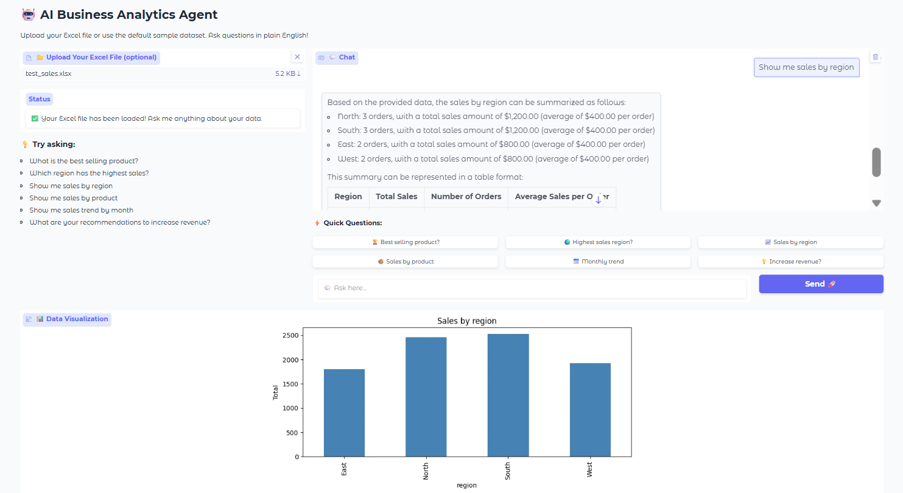

# 🤖 AI-Assisted Data Analysis Agent


> A conversational AI agent that lets **anyone** upload an Excel file and ask business questions in plain English — no SQL, no coding, no dashboards needed.



---

## 💡 What Problem Does This Solve?

Business analysts spend hours manually slicing data in Excel or building dashboards before a non-technical stakeholder can get a single answer.

This agent eliminates that bottleneck. Upload any Excel file → ask questions in plain English → get instant answers + auto-generated charts.

**"What is our best selling product?"**
**"Which region is underperforming?"**
**"What are your recommendations to increase revenue?"**

All answered instantly, with zero technical knowledge required.

---

## 🏗️ Architecture
Excel File (any)

│

▼

┌─────────────────────┐

│   Data Parser       │  ← Reads sheets, detects columns automatically

│   (Pandas)          │

└─────────┬───────────┘

│

▼

┌─────────────────────┐

│   RAG Pipeline      │  ← Converts tabular data into LLM-readable text context

│   (Text Summary)    │

└─────────┬───────────┘

│

▼

┌─────────────────────┐

│   LLM Query         │  ← Data context + user question sent to Llama 3.1

│   (Llama 3.1 8B)    │

└─────────┬───────────┘

│

▼

┌─────────────────────┐

│   Output Layer      │  ← Natural language answer + auto chart

│   (Gradio UI)       │

└─────────────────────┘

---

## ✨ Features

- 📂 **Upload any Excel file** — works with any structure, any column names
- 🤖 **Natural language Q&A** — ask questions like you'd ask a colleague
- 📊 **Auto data visualization** — charts generated automatically based on your question
- ⚡ **Quick question buttons** — one-click common business queries
- 🎯 **Default sample dataset** — works out of the box, no upload needed
- 🔒 **Privacy-first architecture** — swap Hugging Face with local Ollama for fully private deployment
- 💸 **100% Free** — runs on free Hugging Face inference API

---

## 🧠 How RAG Works Here

Traditional AI tools don't know your data. RAG (Retrieval Augmented Generation) solves this by:

1. **Converting** your Excel data into a structured text summary
2. **Injecting** that summary into every question you ask
3. **Letting** the LLM read your data + answer your question together

Think of it like giving the AI an open-book exam — it reads your data cheat sheet before answering every question.

---

## 🛠️ Tech Stack

| Component | Technology |
|---|---|
| Language | Python 3.10+ |
| Data Processing | Pandas, NumPy, OpenPyXL |
| LLM | Llama 3.1 8B Instruct (Meta) |
| LLM Provider | Hugging Face Inference API |
| RAG Pattern | Custom text summarization pipeline |
| Visualization | Matplotlib |
| Web Interface | Gradio |
| Development | Google Colab |

---

## 🚀 Quick Start

### 1. Clone the repository
```bash
git clone https://github.com/Manaswini-Gopala/ai-assisted-data-analysis-agent.git
cd ai-assisted-data-analysis-agent
```

### 2. Install dependencies
```bash
pip install -r requirements.txt
```

### 3. Get a free Hugging Face token
- Sign up at [huggingface.co](https://huggingface.co)
- Go to Settings → Tokens → New Token
- Copy your `hf_...` token

### 4. Open the notebook
- Open `notebooks/AI_Analytics_Agent.ipynb` in Google Colab
- Paste your Hugging Face token where indicated
- Run all cells
- Click the generated Gradio link

---

## 📁 Project Structure
ai-assisted-data-analysis-agent/

│

├── notebooks/

│   └── AI_Analytics_Agent.ipynb   # Main application notebook

│

├── data/

│   └── test_sales.xlsx            # Sample dataset for testing

│

├── assets/

│   └── screenshot.png             # UI screenshot

│

├── requirements.txt               # Python dependencies

└── README.md                      # You are here

---

## 📊 Sample Questions to Ask

Once running, try these:

| Question | What it does |
|---|---|
| `What is the best selling product?` | Ranks products by revenue |
| `Which region has the highest sales?` | Regional performance breakdown |
| `Show me sales by region` | Auto-generates bar chart |
| `Show me monthly sales trend` | Auto-generates line chart |
| `Which customer segment should we focus on?` | Segment analysis |
| `What are your recommendations to increase revenue?` | AI-generated business insights |

---

## 🔒 Privacy & Enterprise Deployment

The current version uses Hugging Face's inference API. For fully private enterprise deployment:

1. Replace Hugging Face with **Ollama** running locally
2. Deploy on company's internal server
3. Zero data leaves your infrastructure
4. Fine-tune Llama on company-specific data for domain expertise

---

## 🎯 Use Cases

- **Sales teams** — instant revenue analysis without waiting for BI reports
- **Operations managers** — query logistics data conversationally
- **Executives** — ask high-level business questions without touching Excel
- **Small businesses** — enterprise-grade analytics at zero cost

---

## 👩‍💻 Author

**Manaswini Gopala**
MS in Management Information Systems — San Diego State University

[](https://www.linkedin.com/in/manaswini-gopala/)
[](https://github.com/Manaswini-Gopala)
---

## 📄 License

MIT License — free to use, modify, and distribute.